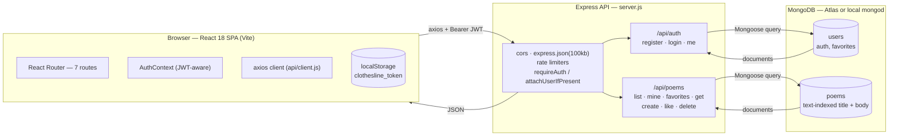
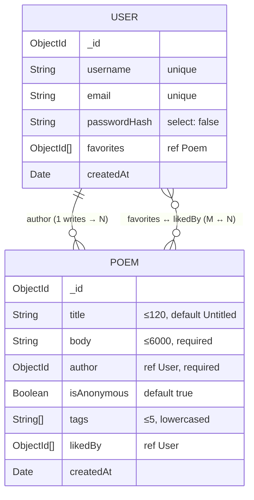
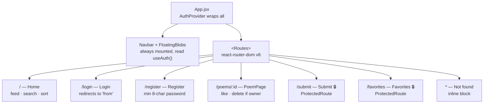

# The Comment Section — Architecture

A MERN app for hanging up poems and half-formed thoughts, signed or anonymous.
This document traces the whole system as it exists in the repository today —
every route, model, page, and the requests that connect them.

## Contents

- [Stack & structure](#stack--structure)
- [System architecture](#system-architecture)
- [Data models](#data-models)
- [Auth & security](#auth--security)
- [API reference](#api-reference)
- [Frontend routes & components](#frontend-routes--components)
- [Client state](#client-state)
- [Feature inventory](#feature-inventory)
- [Config & operations](#config--operations)
- [Known gaps](#known-gaps)

---

## Stack & structure

Two independent npm packages in one repo — no shared build, no monorepo
tooling. The frontend talks to the backend purely over HTTP.

**Stack:** React 18 + Vite · React Router 6 · Express 4 · MongoDB / Mongoose 8
· JWT auth · axios

### `backend/`

```
backend/
├── server.js         # app entry: middleware, routers, listen()
├── config/
│   └── db.js          # connectDB() — mongoose.connect(MONGO_URI)
├── middleware/
│   └── auth.js         # requireAuth, attachUserIfPresent
├── models/
│   ├── User.js          # schema + hashPassword/comparePassword
│   └── Poem.js           # schema + toPublicJSON
└── routes/
    ├── auth.js           # /register /login /me
    └── poems.js           # CRUD + like
```

### `frontend/src/`

```
frontend/src/
├── main.jsx           # ReactDOM root, BrowserRouter
├── App.jsx             # route table, layout shell
├── api/
│   └── client.js        # axios instance + every API call
├── context/
│   └── AuthContext.jsx    # user session, login/register/logout
├── components/
│   ├── Navbar.jsx          # nav + session-aware links
│   ├── PoemCard.jsx         # grid card + Peg icon
│   ├── ProtectedRoute.jsx    # redirects when logged out
│   ├── FloatingBlobs.jsx      # decorative background
│   └── Loader.jsx              # loading state
└── pages/
    ├── Home.jsx, PoemPage.jsx, Submit.jsx
    └── Login.jsx, Register.jsx, Favorites.jsx
```

---

## System architecture

A single-page React app talks to a stateless Express API over JSON; the API
is the only thing that touches MongoDB. Sessions live entirely in a
client-held JWT — the server keeps no session store.



The server is stateless — every request re-verifies the JWT it's handed.
Mongoose is the only path to the database on either collection.

---

## Data models

Two Mongoose collections. A poem always keeps its true author for ownership
checks — `isAnonymous` only controls what *readers* see.



**`User` methods**
- `statics.hashPassword(plain)` — bcrypt hash, 10 rounds
- `.comparePassword(plain)` — bcrypt compare
- `.toPublicJSON()` → `{ id, username, email, createdAt }`

**`Poem` methods**
- `index({ title: "text", body: "text" })`
- `.toPublicJSON(currentUserId)` → adds `likes`, `likedByMe`, `isOwner`,
  and `authorName` (blank when `isAnonymous`)

Liking a poem writes **two** documents in one request handler: it pushes onto
`Poem.likedBy` and `$addToSet`s onto `User.favorites` — there's no separate
Like collection.

---

## Auth & security

Stateless JWT auth. Passwords are hashed with bcrypt (10 rounds) and never
leave the server; the token carries only the user's `_id` as `sub`.

```mermaid
sequenceDiagram
    participant B as Browser · AuthContext
    participant S as Express · auth.js

    B->>S: POST /api/auth/login { email, password }
    S->>S: user.comparePassword()
    S->>S: jwt.sign({ sub: user._id })
    S-->>B: 200 { user, token }
    B->>B: setToken() → localStorage

    Note over B,S: — on every later request —

    B->>S: GET /api/poems/mine<br/>Authorization: Bearer &lt;token&gt;
    S->>S: requireAuth: jwt.verify() → req.user.id
    S-->>B: 200 poems the token's user wrote
```

Invalid or expired token → 401 at the middleware; the route handler never
runs. Public `GET` routes use `attachUserIfPresent` instead of `requireAuth`
— same verification, but a missing or bad token is ignored rather than
rejected, so anonymous visitors still see `likedByMe` resolve to `false`.

| Concern | Detail |
|---|---|
| Password handling | bcrypt hash, 10 rounds, via `User.hashPassword()`. `passwordHash` is `select: false` — a plain `find()` never returns it; `login` explicitly re-selects it to compare. |
| Rate limiting | `express-rate-limit`: 20 req / 15 min on all of `/api/auth`, 30 req / 15 min on `POST /api/poems` only — reads are unlimited. |
| Ownership checks | `DELETE /api/poems/:id` compares `poem.author` to `req.user.id` server-side and returns 403 — anonymity never weakens who can take a poem down. |

---

## API reference

Base path `/api`. All bodies and responses are JSON; list endpoints share a
`{ page, limit ≤ 50 }` pagination helper (`paginate()` in `routes/poems.js`).

| Method & route | Auth | Handler does | Params / body |
|---|---|---|---|
| `POST /auth/register` | open | Validates uniqueness of email + username, hashes the password, creates the user, returns a signed token. | `username, email, password` (password ≥ 8 chars) |
| `POST /auth/login` | open | Re-selects `passwordHash`, compares with bcrypt, signs a token on match. | `email, password` |
| `GET /auth/me` | 🔒 auth | Returns the profile for the token's `sub`. | — |
| `GET /poems` | optional | Lists poems; regex search on title/body, exact tag filter, sort by newest or by like count (popular sorts in memory, then paginates). | `search, tag, sort, page, limit` |
| `GET /poems/mine` | 🔒 auth | Poems where `author === req.user.id`, newest first. | `page, limit` |
| `GET /poems/favorites` | 🔒 auth | Poems where `likedBy` contains the current user. | `page, limit` |
| `GET /poems/:id` | optional | Single poem, populated with author username; 404 if missing or the id is malformed. | — |
| `POST /poems` | 🔒 auth | Creates a poem owned by the caller. Rate-limited to 30 / 15 min per the server-wide submit limiter. | `title, body, isAnonymous, tags[≤5]` |
| `POST /poems/:id/like` | 🔒 auth | Toggles `likedBy` for the caller and mirrors the change onto `User.favorites` in the same request. | — |
| `DELETE /poems/:id` | 🔒 auth | Deletes the poem *iff* the caller is its author (403 otherwise), then scrubs it from every user's `favorites`. | — |
| `GET /health` | open | Liveness check — `{ status: "ok" }`. | — |

Unmatched routes fall through to a JSON 404; any thrown error lands in a
final `(err, req, res, next)` handler that logs it and answers a generic 500
— no stack traces reach the client.

---

## Frontend routes & components

`main.jsx` mounts `<App/>` inside a `BrowserRouter`. `App.jsx` wraps
everything in `AuthProvider` and keeps `Navbar` / `FloatingBlobs` mounted
outside the route switch.



🔒 = wrapped in `ProtectedRoute`, which reads `useAuth()` and redirects to
`/login` (remembering the origin path) when there's no user.

| Component | Role |
|---|---|
| `Navbar.jsx` | Brand link, session-aware nav — shows Login/Sign up when logged out, or Favorites/username/Submit/Log out when logged in. |
| `PoemCard.jsx` | Grid tile linking to `/poems/:id`; renders a hand-drawn `Peg` icon, first tag, title, body excerpt, author (or "Anonymous"), and a like count. |
| `ProtectedRoute.jsx` | Gate component: shows `Loader` while auth is resolving, then either renders `children` or redirects to `/login`. |
| `FloatingBlobs.jsx` | Three purely decorative, animated background shapes — `aria-hidden`, no state. |
| `Loader.jsx` | Shared loading indicator with a customizable label, reused across every async page. |

---

## Client state

No Redux, no query cache — just one context for the session, and local
`useState` + `useEffect` per page for server data.

**`AuthContext`** — on mount, if a token exists in `localStorage`, calls
`fetchMe()` to hydrate `user`; clears the token if that fails. Exposes:

- `login(email, password)` → `setToken` + `setUser`
- `register(username, email, password)`
- `logout()` → `clearToken` + `setUser(null)`
- `user, loading` — read via `useAuth()`

**Per-page data fetching** — `Home.jsx` and `Favorites.jsx` hold
`poems / page / pages / loading / error` locally and re-fetch on dependency
change. Home debounces search/sort input by 300ms before calling
`fetchPoems()`, and cancels the pending timeout on unmount or re-trigger.

---

## Feature inventory

**Accounts**
- Register with username, email, and an 8+ character password; server checks
  both fields for uniqueness before creating the account.
- Log in with email + password; session persists as a JWT in `localStorage`
  and is silently restored on reload via `GET /auth/me`.
- Log out clears the token and local user state instantly, no server
  round-trip.

**Writing & publishing**
- Submit a poem with title (optional, defaults to "Untitled"), body
  (required, ≤6000 chars), and up to 5 comma-separated tags.
- Per-poem anonymity toggle — post under your username or hide it,
  independent of any other poem you've written.
- Only the writing account can delete a poem, checked server-side regardless
  of the anonymity flag.

**Discovery**
- Home feed paginated 12 at a time, debounced text search across title and
  body.
- Sort by **Newest first** or **Most loved** (like count, computed in-memory
  after fetch).
- Filter by a single tag via the `tag` query param (used by the API; no
  tag-click UI wired up in the current pages).

**Social**
- Like (♡→♥) any poem while logged in; likes are per-account, so they follow
  you across devices and can be undone.
- Favorites page lists everything you've liked, in the same paginated card
  grid as Home.
- Anonymous readers can browse and open poems, but liking prompts a login
  message instead of the request.

---

## Config & operations

Both apps read config from `.env` (gitignored); the server refuses to boot
without the required values.

| Variable | Where | Purpose |
|---|---|---|
| `MONGO_URI` | backend | Connection string; missing value exits the process before listening. |
| `JWT_SECRET` | backend | Signs/verifies session tokens; missing value exits at boot, before `connectDB()` even runs. |
| `JWT_EXPIRES_IN` | backend | Token lifetime, default `7d`. |
| `CLIENT_ORIGIN` | backend | Comma-separated CORS allowlist, default `http://localhost:5173`. |
| `PORT` | backend | HTTP port, default `5000`. |
| `VITE_API_URL` | frontend | Base URL the axios client targets, default `http://localhost:5000/api`. |

The frontend builds to static files (`vite build` → `frontend/dist`)
deployable to any static host; the backend is a plain Node process
deployable anywhere Node runs. `server.js` keeps a commented-out block for
serving `frontend/dist` directly from Express behind Cloudflare — currently
unused, both apps run as separate processes locally on `5173` / `5000`.

---

## Known gaps

Called out directly in the project's own README — worth keeping in view
before this goes in front of the public internet.

- No profanity filter or content moderation on submitted poems.
- No admin role or moderation panel — the only way to remove a poem is the
  author deleting it themselves.
- Rate limiting is in place but described as a starting point, not a
  hardened defense.
- Tag filtering is fully implemented server-side (`GET /api/poems?tag=`) but
  has no clickable entry point in the current UI.
